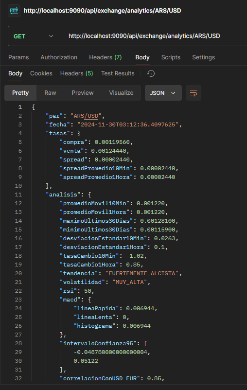
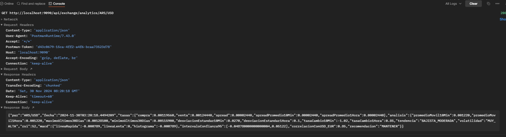

# Servicio de Tipo de Cambio

Microservicio para la gestión y cálculo de tipos de cambio entre diferentes monedas.

## Descripción
API REST para gestión de tipos de cambio y análisis técnico de divisas desarrollada con Spring Boot.

## Arquitectura y Tecnologías
### Stack Tecnológico
- Java 17
- Spring Boot 3.x
- Maven
- H2 Database
- Swagger/OpenAPI
- Lombok
- JUnit 5

## Endpoints

### Test de Conectividad
```bash
GET /api/exchange/test
```
Verifica el estado del servicio.

### 1. Cálculo de Tipo de Cambio
```bash
POST /api/exchange/calculate
```
**Descripción:** Calcula la conversión entre dos monedas considerando tasas directas e inversas.

**Lógica de Negocio:**
- Manejo de conversión directa (USD a otra moneda)
- Conversión inversa (otra moneda a USD)
- Conversión cruzada (entre dos monedas diferentes a USD)


**Request Body:**
```json
{
"monto": 100.00,
"monedaOrigen": "USD",
"monedaDestino": "EUR"
}
```

### 2. Actualización de Tasa
```bash
PUT /api/exchange/rate
```
Actualiza la tasa de cambio entre dos monedas.

**Request Body:**
```json
{
"monedaOrigen": "USD",
"monedaDestino": "EUR",
"tasa": 0.85
}
```

### 3. Análisis Técnico
```bash
GET /api/exchange/analytics/{monedaOrigen}/{monedaDestino}
```
**Componentes del Analisis:**
1. Indicadores Técnicos:
#### a) RSI (Relative Strength Index)
- Implementación: ServicioAnalisisTecnico.java, líneas 18-43

- Fórmula: RSI = 100 - (100 / (1 + RS))
- Períodos: 14 días
- Interpretación:
  - RSI > 70: Sobrecompra
  - RSI < 30: Sobreventa
  - 30-70: Rango neutral

#### b) MACD (Moving Average Convergence Divergence)
- Implementación: ServicioAnalisisTecnico.java, líneas 119-133

**Componentes:**
- EMA Rápida (12 períodos)
- EMA Lenta (26 períodos)
- Línea de Señal (EMA 9 períodos)
- Histograma = MACD - Señal

- **Tendencias**
  - FUERTEMENTE_ALCISTA (>2%)
  - ALCISTA_MODERADA (1-2%)
  - ESTABLE (-1% a 1%)
  - BAJISTA_MODERADA (-1% a -2%)
  - FUERTEMENTE_BAJISTA (<-2%)

#### c) Análisis de Volatilidad
- Implementación: ServicioAnalisisTecnico.java, líneas 71-81
- Clasificación basada en desviación estándar:
  - MUY_ALTA (>2%)
  - ALTA (1.5-2%)
  - MODERADA (1-1.5%)
  - BAJA (0.5-1%)
  - MUY_BAJA (<0.5%)


2. Metricas de Mercado:
- Spreads (actual, 10min, 1hora)
- Promedios móviles
- Máximos y mínimos (30 días)
- Intervalos de confianza 95%
- Correlación con USD/EUR

3. Sistema de Recomendaciones:
- Implementación: ServicioAnalisisTecnico.java, líneas 103-117
- Factores considerados:
  - Tendencia del mercado
  - Nivel de RSI
  - Señales MACD
- Recomendaciones posibles:
  - COMPRAR
  - MANTENER
  - VENDER

### 4. Características Técnicas
**Manejo de Errores**
- Excepciones personalizadas para escenarios específicos
- Respuestas HTTP estandarizadas
Logging detallado de errores
- Validaciones
- Validación de monedas soportadas
- Verificación de rangos válidos
- Validación de datos de entrada

## Arquitectura

### Capas
1. **Controladores** (infrastructure/rest/controller)
   - Manejo de endpoints HTTP
   - Validación de entrada
   - Documentación Swagger

2. **Servicios** (application/services)
   - Lógica de negocio
   - Cálculos técnicos
   - Transformación de datos

3. **Dominio** (domain)
   - Entidades
   - Puertos
   - Excepciones de dominio

4. **Infraestructura** (infrastructure)
   - Implementación de repositorios
   - DTOs
   - Configuraciones

## Instalación y Ejecución

```bash
# Clonar repositorio
git clone https://github.com/michelrojas25/GlobalExchangeService.git

# Instalar dependencias
mvn clean install

# Ejecutar el proyecto
mvn spring-boot:run
```


## Documentación API
La documentación detallada de la API está disponible en:

```bash
http://localhost:9090/swagger-ui.html
```

## Pruebas
El proyecto incluye:
- Pruebas unitarias
- Pruebas de integración
- Pruebas de rendimiento

## Consideraciones Técnicas
- Implementación de caché pendiente
- Datos históricos simulados (pendiente integración con base de datos)
- Validaciones de monedas soportadas
- Manejo de errores centralizado

## Consideraciones de Implementación
- Base de datos:
  - Actualmente usa H2 (en memoria)
  - Preparado para migrar a una BD productiva
- Datos históricos:
  - Simulación temporal de datos históricos
  - Pendiente integración con fuente de datos real
- Optimizaciones pendientes:
  - Implementación de caché
  - Mejora en cálculos de EMA
  - Paralelización de cálculos intensivos

## Licencia
MIT

### Consulta desde el postman



